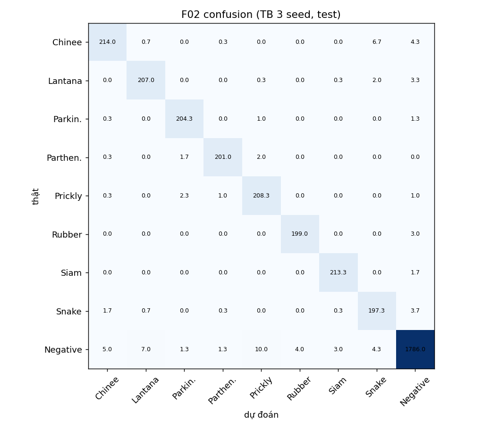
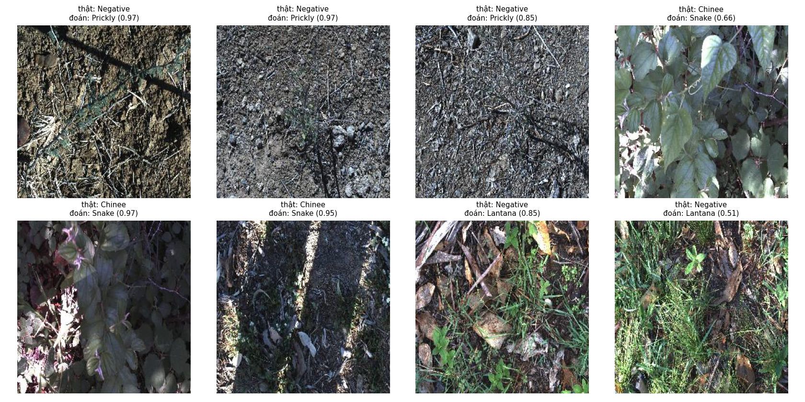

# Báo cáo Lab Day 2: Backbone, công thức huấn luyện và suy luận trên DeepWeeds
Sinh viên: Bùi Đăng Khoa, MSSV 2A202602617

## 1. Tóm tắt
Trên DeepWeeds (fold 0), mình so sánh 5 backbone, 6 thay đổi công thức huấn luyện và nhiều cách suy luận.
Cấu hình tốt nhất: ConvNeXt-Tiny (trọng số timm convnext_tiny.in12k_ft_in1k) + CutMix + temperature scaling (F02), 10 epoch, 224.
Kết quả test (3 seed, mỗi seed chạy test đúng một lần): macro-F1 = 0.9725 ± 0.0017, top-1 = 0.9781 ± 0.0009, ECE = 0.0058.
Mốc (T00 + I00): macro-F1 = 0.9673 ± 0.0017. Cải thiện +0.0052, gấp khoảng 3 lần std nhưng chưa đạt 0.01.
Kết luận chính: khởi tạo từ trọng số tiền huấn luyện là yếu tố lớn nhất; CutMix giúp nhỏ nhưng vượt nhiễu; độ phân giải test 288 hứa hẹn trên val (chưa kiểm chứng trên test).

## 2. Dữ liệu và thiết lập
- Fold 0: train/val/test = 10501/3501/3507 ảnh (59.97/20.0/20.03%); giao rỗng, hợp 17509, không thiếu file.
- Train: Negative 5463, mỗi loài 605-675. Val và test có phân bố tương tự.
- Công thức nền: AdamW, LR backbone 1e-4, head 1e-3, wd 0.05 (không áp dụng cho norm/bias), warmup 1 epoch + cosine, CE, batch 64, AMP, 10 epoch, RandomResizedCrop(224, scale 0.35-1) + lật ngang.
- Phần cứng: Tesla T4 (Colab). Chọn checkpoint theo macro-F1 val. Seed 0/1/2.
- Kiểm tra pipeline: loss ban đầu 2.198 (ln9 = 2.197); overfit 1 batch: loss 2.199 -> 0.009; focal gamma=0 trùng CE (sai số 0); label smoothing eps=0 trùng CE.

## 3. So sánh backbone (1 seed, val)
| exp | backbone | tag trọng số | Params (M) | GMAC | s/epoch | p50 ms (b1) | macro-F1 val |
|---|---|---|---|---|---|---|---|
| B01 | resnet50 | a1_in1k | 23.5 | 4.11 | 39.5 | 6.5 | 0.7846 |
| B02 | resnext50_32x4d | a1h_in1k | 23.0 | 4.26 | 47.1 | 8.3 | 0.8015 |
| B03 | convnext_tiny | in12k_ft_in1k | 27.8 | 4.47 | 50.3 | 6.2 | 0.9674 |
| B04 | swin_tiny | ms_in1k | 27.5 | 4.51 | 64.1 | 10.0 | 0.9528 |
| B05 | efficientnet_b0 | ra_in1k | 4.0 | 0.40 | 34.1 | 10.7 | 0.8008 |

Nhận xét: ConvNeXt-T vừa tốt nhất vừa nhanh nhất, nên chọn làm backbone chính. Cảnh báo công bằng: trọng số ConvNeXt được tiền huấn luyện thêm trên ImageNet-12k, nên một phần lợi thế đến từ dữ liệu tiền huấn luyện chứ không chỉ kiến trúc. ResNet-50 và ResNeXt-50 còn đang cải thiện ở epoch cuối với LR 1e-4, có thể bị thiệt dưới công thức này. EfficientNet-B0 ít GMAC nhất nhưng chậm hơn ConvNeXt-T: FLOPs không dự đoán độ trễ ở batch 1. Mới 1 seed, chênh lệch lớn (>0.15) vượt xa nhiễu.
Đo độ trễ: warmup 30, 200 lần, synchronize. Lần đo đầu của ResNet-50 (24 ms) bị loại vì chưa ổn định; số chính thức lấy từ lần đo lại.

## 4. Công thức huấn luyện (ConvNeXt-T, val)
Nền T00 (3 seed): 0.9647 ± 0.0024. Mỗi thí nghiệm khác nền đúng một yếu tố; T01-T06 mới 1 seed.
| exp | trục | thay đổi | macro-F1 val | Δ vs mean T00 | kết luận |
|---|---|---|---|---|---|
| T01 | A khởi tạo | từ đầu | 0.2821 | -0.683 | tệ hơn rõ rệt |
| T02 | A khởi tạo | đóng băng, chỉ train head | 0.8459 | -0.119 | tệ hơn rõ rệt |
| T03 | B augmentation | + ColorJitter | 0.9659 | +0.001 | không phân biệt được |
| T04 | B augmentation | CutMix | 0.9699 | +0.005 | xem F01 |
| T05 | C loss | label smoothing 0.1 | 0.9629 | -0.002 | không phân biệt được |
| T06 | C loss | CE trọng số lớp | 0.9610 | -0.004 | không phân biệt được |
F01 (CutMix, 3 seed): 0.9691 ± 0.0007, cao hơn nền +0.0044, lớn hơn cả hai std, nên coi CutMix cải thiện thật nhưng nhỏ. Khởi tạo từ đầu thất bại dưới LR 1e-4 và 10 epoch, đây là "từ đầu theo công thức nền", không phải kết luận tuyệt đối. ColorJitter chậm gấp đôi (90 s/epoch) do CPU Colab. Chưa thử kết hợp nhiều yếu tố hay EMA/LR do giới hạn quota GPU. Phương pháp chọn: lần lượt từng trục, nên thứ tự có thể ảnh hưởng.

## 5. Suy luận (val, F01 seed 0, chủ yếu 1 seed)
| mã | phương pháp | macro-F1 | top-1 | ECE | p50/p95/p99 ms |
|---|---|---|---|---|---|
| I00 | 1-view 224 AMP | 0.9699 | 0.9769 | 0.0077 | 7.7/11.5/14.5 |
| I08 | FP32 224 | 0.9699 | 0.9769 | 0.0074 | 9.4/12.7/15.8 |
| I01 | TTA lật, gộp logit | 0.9712 | 0.9774 | 0.0085 | 15.1/18.0/21.9 |
| I03 | TTA lật, gộp xác suất | 0.9712 | 0.9774 | 0.0095 | 15.8/17.9/21.7 |
| I04 | độ phân giải 256 | 0.9737 | 0.9797 | 0.0169 | 9.8/13.8/14.6 |
| I04 | độ phân giải 288 | 0.9789 | 0.9837 | 0.0304 | 7.7/9.7/12.7 |
| I07 | 288 + temperature scaling (T=0.669) | 0.9789 | 0.9837 | 0.0028 | như 288 |
| I05 | ensemble 3 seed @224 | 0.9730 | 0.9800 | 0.0093 | ~3x |
| I05 | ensemble 3 seed @288 | 0.9789 | 0.9840 | 0.0296 | ~3x |
Nhận xét: tăng độ phân giải test là cải thiện lớn nhất (+0.009), phù hợp hiện tượng FixRes khi train dùng RandomResizedCrop, nhưng làm ECE tăng; temperature scaling khớp trên val đưa ECE về 0.0028. TTA lật chỉ +0.0013 (trong nhiễu) mà độ trễ gấp đôi, không đáng cho thời gian thực. FP16 cùng độ chính xác với FP32 và nhanh hơn. Độ trễ 288 thấp hơn 256 là nhiễu đo (GPU dùng chung), chỉ nên nói chi phí cùng bậc. Ngoại tuyến: độ phân giải 288 + TS (hoặc ensemble); thời gian thực: 1-view AMP, p95 khoảng 8-12 ms, thoả ngưỡng 100 ms rất dư.
Quan trọng: cấu hình 288 chỉ được chọn trên val và chưa chạy trên test. Kết quả chính thức giữ F02 (224 + TS) vì F02 đã được chạy test trước; không chạy test lại để chọn số đẹp hơn.

## 6. Cấu hình tốt nhất và kết quả test (3 seed, test chạy một lần mỗi seed)
| chỉ số | mốc T00+I00 | F02 | Δ |
|---|---|---|---|
| top-1 | 0.9739 ± 0.0010 | 0.9781 ± 0.0009 | +0.0042 |
| macro-F1 | 0.9673 ± 0.0017 | 0.9725 ± 0.0017 | +0.0052 |
| balanced acc | 0.9691 | 0.9766 | +0.0075 |
| ECE | 0.0156 | 0.0058 | -0.0098 |
| NLL | 0.1021 | 0.0729 | -0.0292 |
| recall Chinee apple | 0.938 | 0.947 | +0.009 |
| recall Snake weed | 0.956 | 0.967 | +0.011 |
Cải thiện ECE/NLL gộp hai yếu tố (CutMix và temperature scaling), chưa tách riêng đóng góp. Val (0.9691) và test (0.9725) khớp nhau. F1 theo lớp: file results.xlsx, sheet PerClass. Chinee apple (0.956) và Snake weed (0.953) vẫn là hai lớp thấp nhất, giống bài báo gốc.
Tái lập: ConvNeXt-T pretrained in12k_ft_in1k, CutMix alpha=1, các siêu tham số ở mục 2, seed 0/1/2, T của temperature scaling khớp riêng từng seed trên val. T00 seed 0 chính là B03.

## 7. Phân tích lỗi (F02, test)

Trung bình 3 seed, các nhầm lẫn lớn nhất (ảnh/seed): Negative->Prickly acacia 10.0, Negative->Lantana 7.0, Chinee apple->Snake weed 6.7, Negative->Chinee apple 5.0. Lỗi chủ yếu là Negative bị đoán thành loài cỏ, không phải nhầm giữa hai loài; Chinee->Snake khoảng 3% (bài báo: 3.4%).

Xem 8 ảnh sai của seed 0 (73 ảnh sai tổng, chọn theo cặp nhầm nhiều nhất, không đại diện toàn bộ): nhiều ảnh Negative là đất/sỏi/rơm với cành mảnh hoặc cây con rất nhỏ; vài ảnh Chinee apple tối, nhiều bóng hoặc gần như không thấy cây. Mô hình có ca sai với độ tin cậy 0.95-0.97, nên temperature scaling không loại được các ca này. Giả thuyết: mô hình dựa vào bối cảnh nền và các ảnh nhập nhằng thật, có thể một số nhãn nhiễu. Chưa kiểm chứng bằng Grad-CAM.

## 8. Kết luận và hạn chế
- Yếu tố đóng góp nhiều nhất: trọng số tiền huấn luyện/backbone (khoảng cách 0.15-0.68 ở F1 val), sau đó độ phân giải test; CutMix và TS đóng góp nhỏ.
- Triển khai robot (30-100 ms): ConvNeXt-T 1-view AMP, p95 khoảng 8-12 ms trên T4; tốt nhất ngoại tuyến: độ phân giải 288 + TS (cần kiểm chứng test).
- Hạn chế: một fold, chia ngẫu nhiên không theo địa điểm nên test có thể lạc quan; 3 seed nên std thô; sàng backbone/ablation chỉ 1 seed; không thử EMA, kết hợp nhiều yếu tố; độ trễ đo trên T4 Colab dùng chung (dao động vài ms); số I5 dùng p95 = 8.0 ms làm tròn từ lần đo ConvNeXt-T; trọng số ConvNeXt có lợi thế dữ liệu tiền huấn luyện; đổi tài khoản Colab giữa chừng (cùng loại GPU T4).
